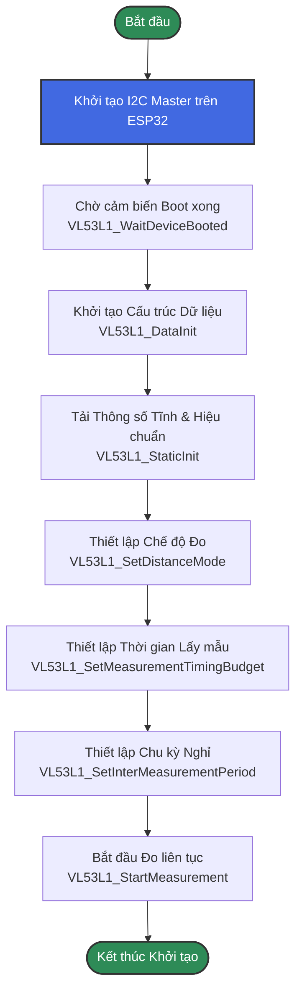
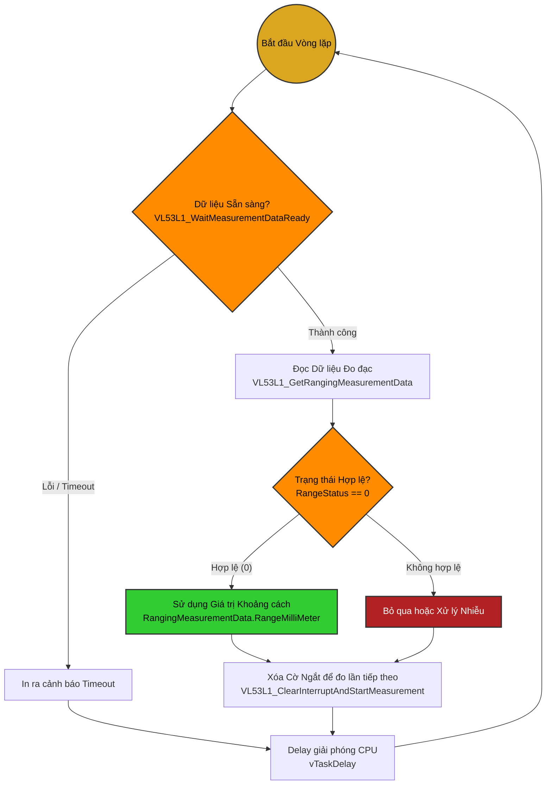

# Hướng Dẫn Sử Dụng Cảm Biến TOF400C-VL53L1X (ESP-IDF)

Tài liệu này mô tả chi tiết cách cấu hình, sử dụng và luồng giải thuật để giao tiếp với cảm biến khoảng cách TOF400C-VL53L1X thông qua giao thức I2C trên nền tảng ESP32 bằng ESP-IDF.

## 1. Sơ đồ kết nối phần cứng
- **VCC/VIN:** Nối với 3.3V của ESP32. (Chip hoạt động ổn định nhất ở mức logic 3.3V).
- **GND:** Nối với GND.
- **SDA:** Nối với chân SDA được thiết lập (VD: GPIO 17).
- **SCL:** Nối với chân SCL được thiết lập (VD: GPIO 18).
- **XSHUT (Tùy chọn):** Nối với VCC hoặc để trống. (Kéo xuống GND sẽ tắt cảm biến).

## 2. Lưu đồ Khởi tạo Cảm Biến (Initialization Flowchart)

Quá trình khởi tạo rất quan trọng để đưa cảm biến vào trạng thái sẵn sàng đo đạc và tải các thông số hiệu chuẩn (calibration) mặc định.

### Chú thích các cấu hình:
- **Distance Mode:** Có các chế độ `SHORT` (ngắn), `MEDIUM` (trung bình), và `LONG` (dài - lên tới 4m).
- **Timing Budget:** Càng dài thì độ chính xác càng cao và ít nhiễu (thường đặt từ 20ms đến 50ms).
- **Inter-Measurement Period:** Thời gian giữa 2 lần đo liên tiếp. Lưu ý: Thời gian này **bắt buộc phải lớn hơn** Timing Budget để vi điều khiển bên trong cảm biến kịp xử lý.

---

## 3. Lưu đồ Vòng Lặp Đo Đạc (Measurement Loop Algorithm)

Sau khi khởi tạo thành công, cảm biến sẽ liên tục thực hiện đo đạc. Vi điều khiển chính (ESP32) sẽ chạy trong một vòng lặp vô tận (hoặc một FreeRTOS task) để poll (hỏi vòng) hoặc chờ ngắt từ cảm biến.

### Các thông số quan trọng trả về trong `RangingMeasurementData`:
- **RangeMilliMeter**: Khoảng cách tính bằng đơn vị milimet (mm).
- **RangeStatus**: Trạng thái kết quả đo. Mã `0` là hoàn toàn chính xác. Các mã khác (như `1` đến `4`) có thể báo hiệu tín hiệu trả về quá yếu, có vật thể giao thoa, hoặc vượt quá tầm đo tối đa.
- **SignalRateRtnMegaCps**: Cường độ tín hiệu phản xạ (có thể dùng để ước tính độ phản xạ của vật thể).

## 4. Xử lý Lỗi (Troubleshooting)
- **Treo I2C hoặc Timeout:** Hãy kiểm tra lại chân SCL, SDA và đảm bảo có điện trở kéo lên (Pull-up resistor) 4.7kΩ hoặc 10kΩ. (Các module TOF400C thường đã tích hợp sẵn).
- **Sai số lớn ở môi trường sáng:** VL53L1X là cảm biến quang học IR. Dưới ánh sáng mặt trời mạnh (chứa nhiều tia hồng ngoại), tầm đo sẽ bị giảm và nhiễu tăng cao. Bạn nên cấu hình Timing Budget cao hơn (>100ms) ở ngoài trời.
