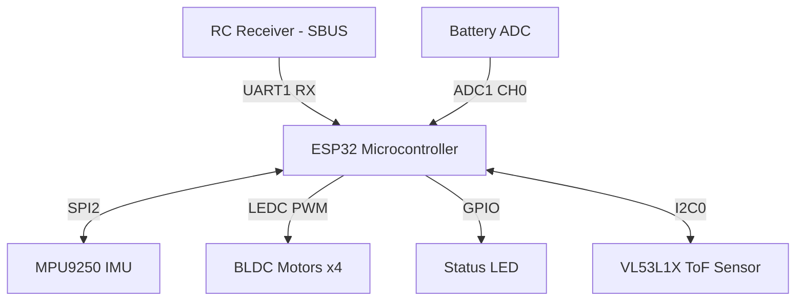
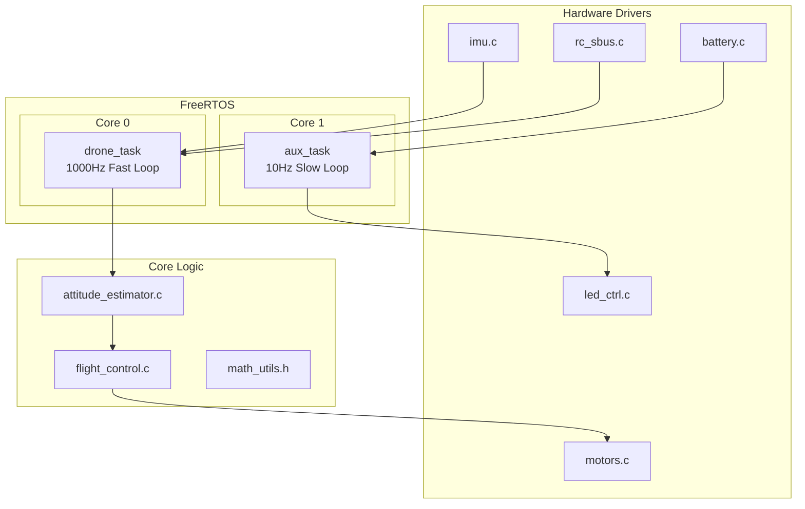
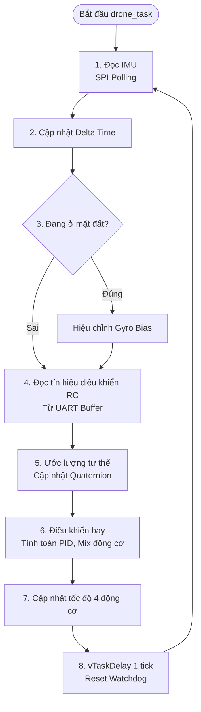

# CF-Drone ESP-IDF Firmware Architecture

Tài liệu này mô tả kiến trúc tổng quan của phần mềm điều khiển bay CF-Drone được port sang nền tảng ESP-IDF (Sử dụng FreeRTOS).

## 1. Kiến trúc phần cứng (Hardware Block Diagram)

Biểu đồ dưới đây mô tả cách ESP32 kết nối với các thiết bị ngoại vi trên Drone:

- **IMU**: Kết nối qua SPI tốc độ cao để đảm bảo độ trễ thấp nhất.
- **SBUS**: Kết nối qua UART1 (chỉ dùng chân RX), cấu hình đảo mức logic tín hiệu ngay bên trong UART driver của ESP32.
- **MOTORS**: Điều khiển bằng module LEDC của ESP-IDF với tần số PWM 25kHz.
- **ToF**: Cảm biến đo khoảng cách kết nối qua I2C.

---

## 2. Kiến trúc phần mềm (Software Block Diagram)

Hệ thống được chia thành 2 task chính chạy song song trên 2 nhân (core) của ESP32 để tối ưu hiệu suất và đảm bảo tính thời gian thực (Real-time).

- **Core 0 (`drone_task`)**: Đảm nhiệm các tác vụ đòi hỏi độ chính xác cao về mặt thời gian như đọc cảm biến IMU, tính toán góc nghiêng, chạy bộ điều khiển PID và xuất xung điều khiển động cơ.
- **Core 1 (`aux_task`)**: Xử lý các tác vụ ít quan trọng hơn như đọc điện áp pin, điều khiển đèn LED nháy cảnh báo và in log ra màn hình.

---

## 3. Lưu đồ thuật toán điều khiển bay (Flight Control Flowchart)

Dưới đây là chi tiết vòng lặp chính của `drone_task`. Vòng lặp này chạy với chu kỳ khoảng 1ms (tương đương 1000Hz).

### Chú thích chi tiết vòng lặp:
1. **Đọc IMU**: Driver đọc dữ liệu từ MPU9250 qua SPI. Bước này có thời gian xử lý rất nhanh nhờ tốc độ SPI 20MHz.
2. **Cập nhật thời gian**: Tính `dt` (thời gian trôi qua so với vòng lặp trước) để dùng cho các phép tích phân.
3. **Hiệu chỉnh Gyro**: Nếu drone chưa được arm (động cơ chưa quay) và đang nằm im, bộ lọc sẽ liên tục tìm và bù trừ sai số (bias) của Gyroscope.
4. **Đọc RC**: Hàm đọc sẽ lấy frame dữ liệu mới nhất (nếu có) từ bộ đệm của UART. Không làm block task.
5. **Ước lượng tư thế**: Sử dụng dữ liệu Gyro và Accel để cập nhật góc nghiêng (Roll, Pitch) và hướng (Yaw) thông qua Quaternion.
6. **Điều khiển bay**: Xử lý logic an toàn (Arm/Disarm), Desaturation, và chạy bộ PID vòng ngoài (Angle) + vòng trong (Rate).
7. **Cập nhật động cơ**: Đẩy dữ liệu ra module LEDC để thay đổi độ rộng xung PWM ngay lập tức.
8. **Delay 1 tick**: Block task trong 1ms để đảm bảo các task hệ thống (IDLE) của FreeRTOS được chạy, tránh lỗi Task Watchdog Timeout.
