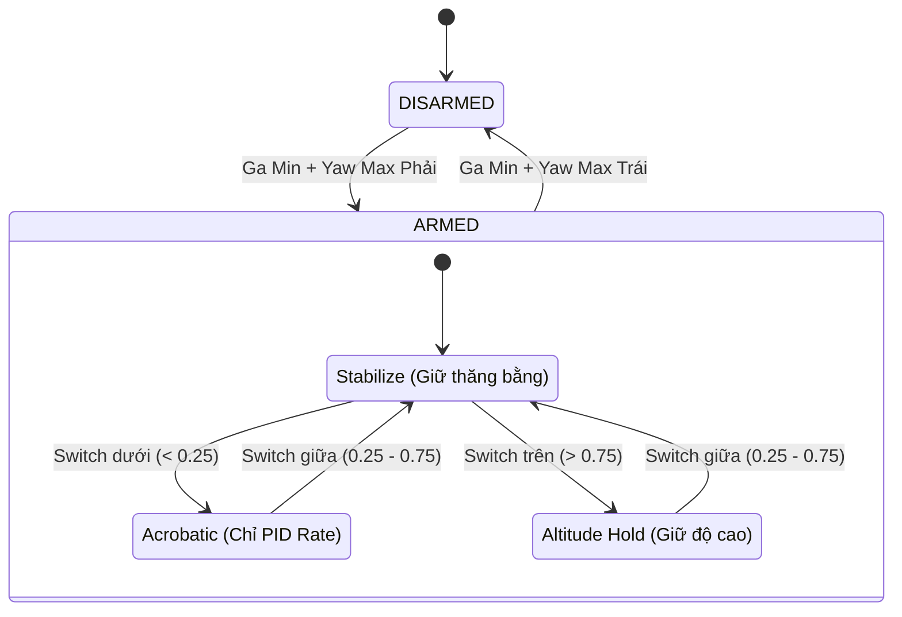
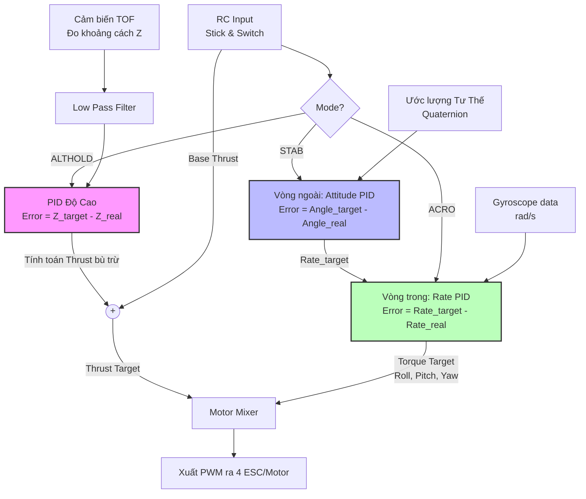

# Kiến Trúc Hệ Thống CF-Drone (ESP-IDF)

Tài liệu này giải thích chi tiết toàn bộ chương trình điều khiển bay (Flight Controller) của drone, từ sơ đồ kết nối phần cứng, nguyên lý điều khiển động cơ, các chế độ bay, cho đến giải thuật cốt lõi và lưu đồ hệ thống.

---

## 1. Sơ đồ nối chân và Phần cứng (Hardware Pinout & Connections)

Drone sử dụng ESP32 làm vi điều khiển trung tâm, kết nối với nhiều cảm biến và ngoại vi khác nhau để nhận thức không gian và điều khiển bay.

```mermaid
graph LR
    subgraph ESP32 [Vi Điều Khiển ESP32]
        SPI[SPI2]
        I2C[I2C0]
        UART[UART1]
        PWM[LEDC PWM]
        ADC[ADC1]
    end

    IMU[Cảm biến góc MPU9250]
    TOF[Cảm biến độ cao VL53L1X]
    RC[Mạch thu sóng SBUS]
    MOTORS[4x Động cơ BLDC/Brushed]
    BATT[Mạch đo áp Pin]
    LED[Đèn LED trạng thái]

    SPI <-->|MISO, MOSI, SCK, CS| IMU
    I2C <-->|SDA=GPIO16, SCL=GPIO17| TOF
    UART <--|RX, Đảo mức logic nội| RC
    PWM -->|Tần số 25kHz| MOTORS
    ADC <--|Chân chia áp| BATT
    ESP32 -->|GPIO| LED
```

- **IMU (MPU9250):** Giao tiếp qua SPI để đạt tốc độ cao nhất (~1kHz polling), giúp giảm độ trễ phản hồi của thuật toán.
- **TOF (VL53L1X):** Giao tiếp I2C, đo khoảng cách với mặt đất để phục vụ chế độ giữ độ cao (Altitude Hold).
- **RC SBUS:** Tín hiệu điều khiển từ tay cầm, sử dụng UART với tính năng đảo mức logic (Inverted RX) tích hợp sẵn trong ESP32.

---

## 2. Các Chế Độ Hoạt Động (Operating Modes)

Chương trình quản lý trạng thái bay thông qua cơ chế State Machine. Việc Arm/Disarm được thực hiện bằng cử chỉ trên cần gạt (Stick Gestures).



### Giải thích các chế độ:
1. **DISARMED:** Động cơ bị khóa, không quay dù có đẩy ga. An toàn tuyệt đối.
2. **ACRO (Manual/Rate Mode):** 
   - Cần gạt RC điều khiển trực tiếp **tốc độ xoay** (rad/s).
   - Drone sẽ không tự động cân bằng lại khi buông cần. Thích hợp cho bay lượn lách, nhào lộn.
3. **STAB (Stabilize/Angle Mode):** 
   - Cần gạt RC điều khiển **góc nghiêng mục tiêu** (Angle).
   - Khi buông cần về giữa, drone tự động cân bằng nằm ngang hoàn toàn.
4. **ALTHOLD (Altitude Hold Mode):** 
   - Drone tự động giữ thăng bằng (như STAB) VÀ **tự động giữ độ cao** lơ lửng nhờ cảm biến TOF.
   - Khi cần ga ở mức ~50% (deadband ±5%), PID trục Z tự động điều chỉnh lực nâng để giữ nguyên khoảng cách tới mặt đất. Khi đẩy ga lên/xuống, drone mới thay đổi độ cao.

---

## 3. Nguyên Lý Điều Khiển Động Cơ & Mixer (Motor Mixing)

Khung drone cấu hình theo chữ **X (X-Frame)**. Để điều khiển được drone, chương trình tính toán 4 yếu tố: **Lực nâng tổng (Thrust), Roll (Cuộn), Pitch (Chúc/Ngóc), Yaw (Xoay đầu)**, sau đó "trộn" (mix) lại thành tốc độ riêng biệt cho 4 động cơ.

```mermaid
graph TD
    subgraph X-Frame Layout (Top View)
        M3((M3: Trước Trái<br>Quay Cùng Chiều)) ~~~ M2((M2: Trước Phải<br>Quay Ngược Chiều))
        M0((M0: Sau Trái<br>Quay Ngược Chiều)) ~~~ M1((M1: Sau Phải<br>Quay Cùng Chiều))
    end
    
    T[Lực Nâng Tổng - Thrust] --> MIXER{Motor Mixer}
    R[Lực Xoay Trái/Phải - Roll] --> MIXER
    P[Lực Ngóc/Chúc - Pitch] --> MIXER
    Y[Lực Xoay Đầu - Yaw] --> MIXER
    
    MIXER --> |T + Roll - Pitch + Yaw| M3
    MIXER --> |T - Roll - Pitch - Yaw| M2
    MIXER --> |T + Roll + Pitch - Yaw| M0
    MIXER --> |T - Roll + Pitch + Yaw| M1
```

- **Tiến lên (Pitch âm):** Giảm tốc 2 motor trước (M3, M2), Tăng tốc 2 motor sau (M0, M1).
- **Nghiêng phải (Roll dương):** Tăng tốc 2 motor bên trái (M3, M0), Giảm tốc 2 motor bên phải (M2, M1).
- **Xoay đầu (Yaw):** Lợi dụng phản lực mô-men xoắn. Tăng tốc 2 motor quay cùng chiều (CW), giảm tốc 2 motor quay ngược chiều (CCW) để làm thân drone xoay theo hướng ngược lại mà không làm mất độ cao.

---

## 4. Giải Thuật Cốt Lõi (Control Algorithm & Cascaded PID)

Hệ thống sử dụng bộ điều khiển PID nối tiếp (Cascaded PID) gồm 2 vòng lặp: Vòng ngoài (Angle) chậm hơn và vòng trong (Rate) cực nhanh. Cùng với đó là vòng lặp thứ 3 (Altitude PID).



1. **Outer Loop (Attitude PID):** Lấy sai số giữa góc nghiêng mục tiêu (từ tay cầm) và góc thực tế (từ Quaternion) để tính ra *tốc độ xoay cần thiết* (Rate Target).
2. **Inner Loop (Rate PID):** Lấy sai số giữa *tốc độ xoay cần thiết* và tốc độ xoay thực tế (đọc trực tiếp từ Gyro) để tính ra *lực xoắn* (Torque) xuất ra mô-tơ. Nhờ có vòng lặp này, drone phản ứng tức thời với gió tạt.

---

## 5. Lưu Đồ Vòng Lặp Phần Mềm (Software Flowchart)

Hệ thống chạy trên FreeRTOS với 2 task chính: `drone_task` (Core 0, cực nhanh) và `tof_task/aux_task` (Core 1, chậm hơn).

```mermaid
flowchart TD
    subgraph Core 1 [Core 1: Cảm biến chậm & Telemetry]
        TOF_T([tof_task ~25Hz]) --> ReadI2C[Poll I2C VL53L1X]
        ReadI2C --> FilterTOF[Lọc LPF & Cập nhật biến Share]
        FilterTOF --> Delay2[vTaskDelay]
        Delay2 --> TOF_T
        
        AUX_T([aux_task ~10Hz]) --> ReadBatt[Đọc ADC Pin]
        ReadBatt --> PrintLog[In Telemetry Log]
        PrintLog --> BlinkLED[Nháy LED cảnh báo]
        BlinkLED --> Delay3[vTaskDelay]
        Delay3 --> AUX_T
    end

    subgraph Core 0 [Core 0: Flight Control Fast Loop]
        Start([drone_task ~1000Hz]) --> ReadIMU[1. Đọc IMU SPI<br>Blocking tới khi có data]
        ReadIMU --> StepTime[2. Tính thời gian Delta dt]
        
        StepTime --> CheckLand{3. Đang đậu?}
        CheckLand -- Đúng --> Calib[Hiệu chỉnh Gyro Bias]
        CheckLand -- Sai --> ReadRC[4. Đọc SBUS/WebRC]
        Calib --> ReadRC
        
        ReadRC --> Est[5. Cập nhật Quaternion<br>Madgwick Filter]
        Est --> GetTOF[6. Đọc Độ cao TOF<br>Từ biến Share Core 1]
        
        GetTOF --> FC[7. Chạy PID & Safety<br>Attitude/Rate/AltHold]
        FC --> Mix[8. Trộn tín hiệu 4 Motor<br>Clamp & Desaturation]
        
        Mix --> SetPWM[9. Cập nhật thanh ghi LEDC PWM]
        SetPWM --> Delay1[10. vTaskDelay 1ms<br>Nhường CPU / Xóa WDT]
        Delay1 --> ReadIMU
    end
```



### Đặc điểm thiết kế:
- **Tách biệt Core:** Xử lý điều khiển bay đòi hỏi độ chính xác cao được gán chặt vào Core 0, tách biệt hoàn toàn khỏi các tác vụ I2C chặn (blocking) hoặc in log tốn thời gian ở Core 1.
- **Data Sharing:** Dữ liệu độ cao (Z) được chuyển từ Core 1 sang Core 0 một cách an toàn thông qua thao tác gán Atomic trên biến chia sẻ (volatile) trong cấu trúc `flight_state_t`. Tương tự với trạng thái pin.
